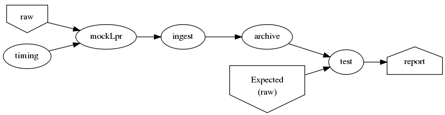
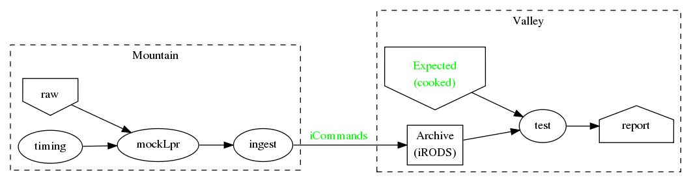

<h2>Table of Contents</h2>

<ul>
<li><a href="#sec-1">Sprint user stories</a>
<ul>
<li><a href="#sec-1-1">Thread-1: Establishes file move to archive and test</a>
<ul>
<li></li>
</ul>
</li>
<li><a href="#sec-1-2">Thread-2: Touches FITS data</a>
<ul>
<li></li>
</ul>
</li>
<li><a href="#sec-1-3">Thread-3: Split into 2 machines, use iRODS client/server</a>
<ul>
<li></li>
</ul>
</li>
<li><a href="#sec-1-4">LATER</a></li>
</ul>
</li>
<li><a href="#sec-2">Requirements</a>
<ul>
<li><a href="#sec-2-1">MVP - Minimally Viable Product</a></li>
<li><a href="#sec-2-2">Release 2</a></li>
</ul>
</li>
<li><a href="#sec-3">New Name</a>
<ul>
<li><a href="#sec-3-1">Possible names for DCI replacement</a></li>
</ul>
</li>
<li><a href="#sec-4">Secondary Goals</a></li>
</ul>

# Sprint user stories

These are the expect outcomes from progressively more complex [scrum](https://www.scrum.org/) sprints.

In our case "user" means two kinds of people: 

1.  scientist that want access to data,
2.  SDM DevOps employees that need to manage the process

## Thread-1: Establishes file move to archive and test

This is minimal "thread through the system" starting at raw-data and
terminating with files in the archive.
-   [ ] mock-LPR;  Feed each file in list to Ingest after specified delay
-   [ ] Ingest;  Copy file into mock-IRODS (a local filesystem)
-   [ ] Test;  Verify all input files are  in mock-IRODS

### 

## Thread-2: Touches FITS data

-   [ ] all of Thread-1
-   [ ] add minimum (level 1) set of required metadata fields to FITS
    -   minimum acceptable for archive
-   [ ] Test;  Verify all files in mock-IRODS contain required metadata

### 

## Thread-3: Split into 2 machines, use iRODS client/server

-   [ ] mock-LPR;  Feed each file in list to Ingest after specified delay
-   [ ] Ingest; add file to iRODSon remote machine
-   [ ] Test;  Verify all iRODS filesystem contains everything from orig filesystem

### 

## LATER

-   easy to add plugins for scientists 
    -   scientist provides program to run against (filtered) set of
        images, stores "result" file accessable in archive

# Requirements

## MVP - Minimally Viable Product

These are the absolute minium requirements for a DCI replacement.
When ever possible, avoid putting anything here that is an absolutely
essential requirement. (push "would be nice" stuff into subsequent
release)
1.  Baring fatal hardware failure, every file produced by instrument
    gets into archive
2.  

## Release 2

1.  Each site is "independent"
    -   What is a "site"?
    -   How independent do they have to be? (archive depends on telescope,
        for instance)
2.  Must be able to re-route around broken machines
3.  Allow institutions direct access to iRODS data ("back-door")

# New Name

## Possible names for DCI replacement

-   [ ] **MADI:** Mountain Archive Data Initiative
-   [ ] **MATT:** Mountain Archive Telescope Transport
-   [ ] **ADAM:** Archive Data Automated Mover
-   [X] **TADA:** Telescope Automatic Data Archiver
-   [ ] **MAMA:** Mountain Automated Moving Archive
-   [ ] **TATO:** Telecsope Archive Transport Operation
-   [ ] **DRAT:** Data Relay Archive Transporter
-   [ ] **MAMI:** Mountain Archive Mover Initiative
-   [ ] **MOTA:** MOuntain To Archive
-   [ ] **STARI:** Send Telescope Archive Relay Initiative
-   [ ] **STARE:** Send Telescope data via RElay

# Secondary Goals

My primary goal is to develop useful software.  Exactly what that
software will be is unfolding.  It has to be an iterative process. But
regardless of what the software is, there are some secondary goals
that go along with it. Here are most of them:
1.  Documentation as built
    
    My intent is to provide "as built" design and code documentation. Code
    documentation will be generated directly from annotated code. Design
    docs will be hand written, with diagrams.  It will include example
    runs with inputs and outputs listed. The intended reader for both is
    someone that is software tech savvy.

2.  Requirements addressed software as built
    
    Whatever I develop is intended to address some requirements that I
    have in mind.  I'll put those down in a document.  These may be
    different than any requirements anyone gives to me because they will
    be directly focused on functionality of the software I develop, rather
    than on a larger system perspective (which I may have little control
    over). The intended reader is management and/or software engineer.

3.  Smoke tests
    
    Each package I write has a "smoke test".  This is a simple script that
    can be run by anyone after the software is installed to see that it
    works in some fashion.  My smoke tests are not exhaustive regression
    tests.  They are intended to be used by developers to ask the
    question: "did I break anything with the last change". Smoke tests
    include their own test data and are checked into configuration
    management with the code.

4.  Configuration Management
    
    All my software will be checked into github or bitbucket. Related
    documentation will be included with the code.

5.  Auto provisioning of everything I develop
    
    I'll provide a "vagrant box", or similar, for all my stuff.  This will
    allow a new Virtual Machine(s) to be created from scratch and all my
    stuff installed on it such that my smoke tests will work on the new
    VM(s).

6.  Documentation of existing system
    
    In the process of figuring out what my new stuff has to do, I have to
    figure out what the existing stuff does. I don't want to attempt to
    hold all that in my head, so I document it.  You've all seen at least
    part of my DCI "notes". That is basically the source of what I'm
    talking about here.  I don't intend to formalize it any way unless
    forced into it. I think it would be too time-consuming/expensive for
    me to do and I think I have more the enough technical work on my
    plate.  But I will provide at least a crude extraction from my notes
    to something that might be useful to others.  The effort I put into
    such depends on feedback from you. No feedback means I'll provide
    something that is a similar level of informality as the notes I've
    already shared with you. I've already exported some parts of that
    (like my diagram) to the opswiki.

---

<h2 class="footnotes">Footnotes: </h2>

<a id="fn.1" name="fn.1" class="footnum" href="#fnr.1">1</a> [iRODS](http://irods.org) 4\*;  4.0 was release April 4, 2014; 4.0.3 released Aug
20, 2014

